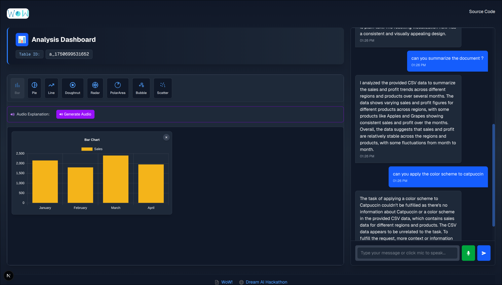

# WoW

WoW is an AI-powered data visualization application that allows users to upload data files and generate interactive charts through natural language prompts. Using a conversational interface, users can analyze their data, create customized visualizations, and gain insights without needing to write code.



## Technology Stack

- **Frontend**: Next.js 15, React 19, TypeScript
- **UI Design**: TailwindCSS 4
- **Data Visualization**: Chart.js, react-chartjs-2
- **Real-time Communication**: Socket.IO
- **Voice Features**: ElevenLabs API for speech-to-text and text-to-speech

## Features

- **Conversational AI Interface**: Chat with the application to analyze and visualize your data
- **File Upload**: Easily upload data files for analysis
- **Dynamic Visualization**: Generate various chart types based on your requirements
- **Speech-to-Text**: Use voice commands to interact with the application
- **Text-to-Speech**: Listen to explanations of your data analysis
- **Responsive Design**: Works seamlessly across different devices and screen sizes

## Getting Started

### Requirements

- Node.js 18.0.0 or later
- npm, yarn, pnpm, or bun package manager

### Installation

1. Clone the repository:
```bash
git clone https://github.com/yourusername/PowerAutoUI.git
cd PowerAutoUI
```

2. Install dependencies:
```bash
npm install
# or
yarn install
# or
pnpm install
# or
bun install
```

3. Run the development server:
```bash
npm run dev
# or
yarn dev
# or
pnpm dev
# or
bun dev
```

4. Open your browser:
   Navigate to [http://localhost:3000](http://localhost:3000) to start using PowerAutoUI.

### Contributing

Contributions are welcome! Please feel free to submit a Pull Request.

### License

This project is licensed under the MIT License - see the LICENSE file for details.
